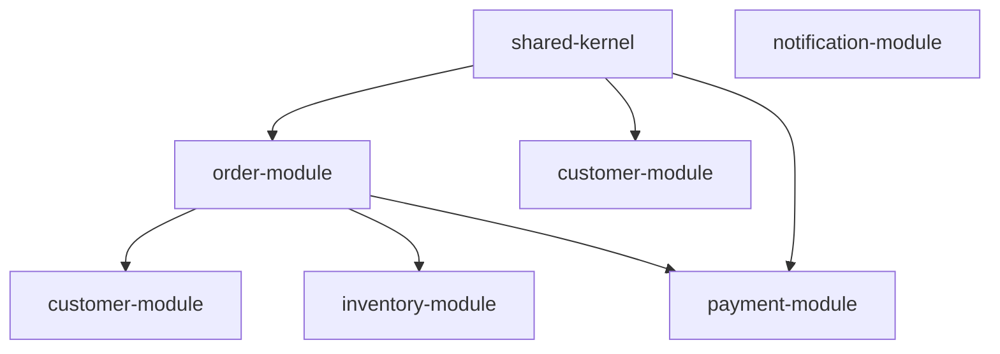

# 模块详细说明

## 1. 共享内核模块 (shared-kernel)

### 概述
共享内核模块包含所有业务模块共享的通用领域概念和值对象，确保跨模块的一致性和类型安全。

### 核心组件

#### OrderId
- **类型**: 值对象
- **职责**: 唯一标识订单
- **特性**: 不可变、类型安全、验证逻辑

#### CustomerId
- **类型**: 值对象
- **职责**: 唯一标识客户
- **特性**: 不可变、类型安全、验证逻辑

#### Money
- **类型**: 值对象
- **职责**: 处理货币计算
- **特性**: 精度控制、货币验证、计算操作

## 2. 订单模块 (order-module)

### 概述
订单模块是核心业务模块，负责订单的整个生命周期管理。

### 架构层次

#### 领域层
- **Order**: 订单聚合根
- **OrderItem**: 订单项实体
- **OrderStatus**: 订单状态枚举

#### 应用层
- **OrderService**: 订单应用服务
  - `createOrder()`: 创建订单
  - `confirmOrder()`: 确认订单
  - `cancelOrder()`: 取消订单
  - `findOrderById()`: 查询订单

- **领域事件**:
  - `OrderCreatedEvent`: 订单创建事件
  - `OrderConfirmedEvent`: 订单确认事件
  - `OrderCancelledEvent`: 订单取消事件

#### 基础设施层
- **OrderRepository**: JPA 仓储接口
- **OrderController**: REST API 控制器

### API 接口

#### 创建订单
```
POST /api/orders
Request Body: CreateOrderRequest
Response: OrderResponse
```

#### 确认订单
```
POST /api/orders/{orderId}/confirm
Response: OrderResponse
```

#### 取消订单
```
POST /api/orders/{orderId}/cancel
Response: OrderResponse
```

#### 查询订单
```
GET /api/orders/{orderId}
Response: OrderResponse
```

## 3. 客户模块 (customer-module)

### 概述
客户模块管理客户信息和客户生命周期状态。

### 核心组件

#### 领域模型
- **Customer**: 客户聚合根
  - 基本信息管理
  - 状态管理
  - 地址管理

- **值对象**:
  - `CustomerName`: 客户姓名
  - `Email`: 邮箱地址
  - `PhoneNumber`: 电话号码
  - `Address`: 地址信息

#### 业务规则
- 邮箱格式验证
- 手机号格式验证
- 地址完整性验证
- 客户状态转换规则

## 4. 库存模块 (inventory-module)

### 概述
库存模块负责产品库存的管理和操作。

### 核心功能

#### 产品管理
- **Product**: 产品聚合根
- **ProductCategory**: 产品分类
- **ProductStatus**: 产品状态

#### 库存操作
- **Inventory**: 库存聚合根
  - 库存查询
  - 库存预留
  - 库存释放
  - 库存消耗
  - 库存调整

#### 业务规则
- 库存数量验证
- 预留库存管理
- 安全库存检查
- 库存不足预警

## 5. 支付模块 (payment-module)

### 概述
支付模块处理支付交易和支付状态管理。

### 核心组件

#### 支付处理
- **Payment**: 支付聚合根
- **PaymentMethod**: 支付方式
- **PaymentStatus**: 支付状态

#### 退款管理
- **Refund**: 退款聚合根
- **RefundStatus**: 退款状态

#### 支持的支付方式
- 支付宝
- 微信支付
- 信用卡
- 银行转账

## 6. 通知模块 (notification-module)

### 概述
通知模块负责系统通知的发送和管理。

### 通知类型

#### 邮件通知
- **EmailNotification**: 邮件通知实体
- 支持 HTML 内容
- 支持抄送和密送

#### 短信通知
- **SmsNotification**: 短信通知实体
- 支持签名
- 内容格式化

#### 其他通知
- 推送通知
- 应用内通知
- 微信通知
- 钉钉通知

### 通知管理
- **Notification**: 通知聚合根
- **NotificationPriority**: 通知优先级
- **NotificationStatus**: 通知状态

## 模块依赖关系



## 模块通信模式

### 1. 同步通信
- REST API 调用
- 直接方法调用（同一应用内）

### 2. 异步通信
- 领域事件发布/订阅
- 消息队列（可选）

### 3. 数据共享
- 共享内核模式
- 事件溯源（可选）

## 扩展性考虑

### 水平扩展
- 每个模块可独立部署
- 支持微服务架构演进
- 容器化部署支持

### 功能扩展
- 插件化架构
- 配置驱动
- AOP 切面编程

## 监控和运维

### 健康检查
- Actuator 端点
- 自定义健康指标
- 模块状态监控

### 日志记录
- 结构化日志
- 分布式追踪
- 审计日志

### 性能指标
- 响应时间监控
- 错误率监控
- 资源使用监控

## 安全考虑

### 数据安全
- 敏感数据加密
- 访问控制
- 数据脱敏

### API 安全
- 身份验证
- 授权控制
- 输入验证

### 审计追踪
- 操作日志
- 变更历史
- 安全事件记录