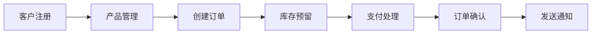

# Spring Modulith 企业级模块化架构指南

## 📋 项目概述

这是一个使用 **Spring Modulith 1.2.0** 构建的企业级模块化架构演示项目，展示了如何在实际应用中实现：
- ✅ 清晰的模块边界和依赖管理
- ✅ 领域驱动设计（DDD）最佳实践
- ✅ 事件驱动架构
- ✅ 完整的 RESTful API（31 个端点）

### 技术栈

| 技术 | 版本 | 说明 |
|------|------|------|
| Spring Boot | 3.5.8 | 应用框架 |
| **Spring Modulith** | **1.2.0** | **模块化架构支持** ⭐ |
| Java | 17/21 | 编程语言 |
| Spring Data JPA | - | 数据访问层 |
| H2 Database | - | 内存数据库 |
| springdoc-openapi | 2.1.0 | API 文档生成 |

---

## 🚀 快速开始

### 环境要求
- **JDK**: 17 或 21
- **Maven**: 3.6+

### 构建和启动

```bash
cd b43-modulith
mvn clean install -DskipTests
cd b43-modulith-app
mvn spring-boot:run
```

### 访问应用

| 服务 | URL | 说明 |
|------|-----|------|
| **Swagger UI** | http://localhost:8080/swagger-ui.html | API 文档和测试界面 ⭐ |
| **H2 控制台** | http://localhost:8080/h2-console | 数据库管理（密码：123456） |
| **健康检查** | http://localhost:8080/actuator/health | 应用状态 |

---

## 🏗️ Spring Modulith 核心特性

### 什么是 Spring Modulith？

Spring Modulith 是一个帮助开发者构建**模块化单体应用**的框架，它提供了：

- ✅ **清晰的模块边界定义** - 通过 `@ApplicationModule` 注解
- ✅ **模块依赖关系验证** - 编译时检查循环依赖
- ✅ **自动模块文档生成** - 可视化模块结构
- ✅ **架构约束检查** - 确保分层架构规范

### 为什么选择模块化单体？

| 传统单体 | 模块化单体 | 微服务 |
|---------|-----------|--------|
| ❌ 代码耦合严重 | ✅ 模块清晰隔离 | ✅ 完全独立部署 |
| ❌ 难以维护 | ✅ 易于扩展 | ❌ 复杂度高 |
| ✅ 部署简单 | ✅ 部署简单 | ❌ 运维复杂 |
| ✅ 开发快速 | ✅ 开发快速 | ❌ 开发周期长 |

**模块化单体**是介于传统单体和微服务之间的最佳平衡点！

---

## 📐 Spring Modulith 架构设计

### 1. 模块定义

使用 `@ApplicationModule` 注解定义模块及其依赖关系：

```java
@ApplicationModule(
    displayName = "订单模块",
    allowedDependencies = {
        "customer-module",
        "inventory-module"
    }
)
package com.axinger.order;

import org.springframework.modulith.ApplicationModule;
```

**关键配置**：
- `displayName` - 模块显示名称
- `allowedDependencies` - 允许依赖的模块列表（防止循环依赖）

### 2. 主应用配置

```java
@SpringBootApplication
@Modulith(
    systemName = "企业级电商平台",
    sharedModules = {"shared-kernel"},
    additionalPackages = {"com.axinger"}
)
public class ModulithApplication {
    public static void main(String[] args) {
        SpringApplication.run(ModulithApplication.class, args);
    }
}
```

### 3. 标准包结构

```
com.axinger.{module}/
├── domain/          # 领域层
│   ├── model/       # 聚合根、实体、值对象
│   └── event/       # 领域事件
├── application/     # 应用层
│   └── service/     # 应用服务
├── infrastructure/  # 基础设施层
│   └── repository/  # 仓储实现
└── web/             # Web 层
    └── controller/  # REST 控制器
```

### 4. 模块依赖关系

```
                    ┌─────────────────┐
                    │  shared-kernel  │  ← 共享内核（值对象）
                    └────────┬────────┘
                             │
         ┌───────────────────┼───────────────────┐
         │                   │                   │
┌────────▼────────┐ ┌───────▼────────┐ ┌───────▼────────┐
│ customer-module │ │inventory-module│ │notification-   │
└────────┬────────┘ └────────────────┘ │module          │
         │                              └────────────────┘
         │
┌────────▼────────┐
│  order-module   │  ← 核心业务模块
└────────┬────────┘
         │
┌────────▼────────┐
│ payment-module  │
└─────────────────┘
```

**依赖规则**：
- `shared-kernel` → 被所有业务模块依赖
- `customer-module` + `inventory-module` → 被 order-module 依赖
- `order-module` → 被 payment-module 依赖
- `notification-module` → 独立模块（通过事件通信）

---

## 🔧 核心技术实现

### 1. 领域事件（模块间通信）

#### 定义事件

```java
public record OrderCreatedEvent(
    OrderId orderId,
    CustomerId customerId,
    double amount,
    LocalDateTime createdAt
) {}
```

#### 发布事件

```java
@Service
@Transactional
public class OrderService {
    
    private final ApplicationEventPublisher eventPublisher;
    
    public Order createOrder(CustomerId customerId, Set<OrderItem> items) {
        Order order = new Order(customerId, items);
        
        // 发布领域事件（触发其他模块响应）
        eventPublisher.publishEvent(new OrderCreatedEvent(
            order.id(),
            order.customerId(),
            order.totalAmount(),
            LocalDateTime.now()
        ));
        
        return order;
    }
}
```

#### 监听事件

```java
@Component
@Slf4j
public class OrderEventHandler {
    
    @TransactionalEventListener(phase = TransactionPhase.AFTER_COMMIT)
    public void handleOrderCreated(OrderCreatedEvent event) {
        log.info("订单创建成功: {}", event.orderId());
        // 执行后续操作：发送通知、更新统计等
    }
}
```

**优势**：
- ✅ 松耦合通信 - 模块间不直接依赖
- ✅ 异步处理 - 提升性能
- ✅ 可扩展性 - 轻松添加新的事件处理器

### 2. 值对象设计

```java
public record OrderId(UUID value) implements Serializable {
    
    public OrderId {
        if (value == null) {
            throw new IllegalArgumentException("订单ID不能为空");
        }
    }
    
    public static OrderId generate() {
        return new OrderId(UUID.randomUUID());
    }
    
    public static OrderId fromString(String id) {
        return new OrderId(UUID.fromString(id));
    }
}
```

**值对象特性**：
- ✅ 不可变性（final + record）
- ✅ 内置验证逻辑
- ✅ 类型安全
- ✅ 工厂方法

### 3. 聚合根设计

```java
@Table(name = "orders")
@Entity
public class Order {
    
    @Id
    @Column(name = "order_id")
    private UUID id;
    
    @Enumerated(EnumType.STRING)
    private OrderStatus status;
    
    private double totalAmount;
    
    // 构造函数
    public Order(CustomerId customerId, Set<OrderItem> items) {
        this.id = OrderId.generate().value();
        this.status = OrderStatus.PENDING;
        this.totalAmount = calculateTotal(items);
    }
    
    // 业务方法（保护业务规则）
    public void confirm() {
        if (this.status != OrderStatus.PENDING) {
            throw new IllegalStateException("只有待确认的订单才能确认");
        }
        this.status = OrderStatus.CONFIRMED;
    }
    
    public void cancel() {
        if (this.status == OrderStatus.CANCELLED) {
            throw new IllegalStateException("订单已取消");
        }
        this.status = OrderStatus.CANCELLED;
    }
}
```

**聚合根特性**：
- ✅ 保护业务规则（状态转换验证）
- ✅ 封装内部状态
- ✅ 提供领域行为方法

---

## 📦 模块详解

### 1. 共享内核 (shared-kernel)

**职责**：提供跨模块共享的通用领域概念

**核心组件**：
- `OrderId` - 订单 ID 值对象
- `CustomerId` - 客户 ID 值对象
- `Money` - 金额值对象

### 2. 订单模块 (order-module) ⭐ 核心业务

**职责**：订单生命周期管理

**API 端点**：
- `POST /api/orders` - 创建订单
- `POST /api/orders/{orderId}/confirm` - 确认订单
- `POST /api/orders/{orderId}/cancel` - 取消订单
- `GET /api/orders/{orderId}` - 查询订单详情

**依赖**：customer-module, inventory-module, payment-module

### 3. 客户模块 (customer-module)

**职责**：客户信息管理和生命周期

**API 端点**：
- `POST /api/customers` - 注册客户
- `POST /api/customers/{customerId}/activate` - 激活客户
- `PUT /api/customers/{customerId}/address` - 更新地址
- `GET /api/customers/{customerId}` - 获取客户详情
- `GET /api/customers/by-email/{email}` - 按邮箱查找
- `GET /api/customers/by-phone/{phone}` - 按电话查找

**值对象**：CustomerName, Email, PhoneNumber, Address

### 4. 库存模块 (inventory-module)

**职责**：产品库存管理

**API 端点**：
- `POST /api/inventory/products` - 创建产品
- `POST /api/inventory/products/{productId}/initialize` - 初始化库存
- `POST /api/inventory/products/{productId}/reserve` - 预留库存
- `POST /api/inventory/products/{productId}/release` - 释放库存
- `POST /api/inventory/products/{productId}/consume` - 消耗库存
- `POST /api/inventory/products/{productId}/add` - 增加库存
- `GET /api/inventory/products/{productId}` - 获取库存信息
- `GET /api/inventory/products/{productId}/check` - 检查库存

### 5. 支付模块 (payment-module)

**职责**：支付处理和交易管理

**API 端点**：
- `POST /api/payments` - 创建支付
- `POST /api/payments/{paymentId}/process` - 处理支付
- `POST /api/payments/{paymentId}/cancel` - 取消支付
- `POST /api/payments/{paymentId}/refund` - 创建退款
- `GET /api/payments/{paymentId}` - 获取支付详情
- `GET /api/payments/by-order/{orderId}` - 按订单查询支付

**支付方式**：支付宝、微信支付、信用卡、银行转账

### 6. 通知模块 (notification-module)

**职责**：系统通知和消息发送

**API 端点**：
- `POST /api/notifications/email` - 发送邮件
- `POST /api/notifications/sms` - 发送短信
- `POST /api/notifications/in-app` - 发送应用内通知
- `POST /api/notifications/{notificationId}/mark-read` - 标记已读
- `GET /api/notifications/{notificationId}` - 获取通知详情
- `GET /api/notifications/user/{recipient}` - 获取用户通知列表

---

## 🎯 API 文档（Swagger UI）

### 访问方式

启动应用后，访问：**http://localhost:8080/swagger-ui.html**

### 功能特性

✅ **自动 API 文档生成** - 无需手动编写  
✅ **交互式测试** - 直接在浏览器中测试 API  
✅ **模块化分组** - 按业务模块分组展示  
✅ **完整模型定义** - 请求/响应数据结构清晰  

### API 分组

Swagger UI 中按模块分组展示：
- 🛒 **订单模块** (orders) - 4 个端点
- 👥 **客户模块** (customers) - 7 个端点
- 📦 **库存模块** (inventory) - 8 个端点
- 💳 **支付模块** (payments) - 6 个端点
- 📧 **通知模块** (notifications) - 6 个端点

**总计：31 个 REST API 端点**

### YAML 配置（避免硬编码）

```yaml
springdoc:
  group-configs:
    - group: orders
      paths-to-match: /api/orders/**
      packages-to-scan: com.axinger.order
    - group: customers
      paths-to-match: /api/customers/**
      packages-to-scan: com.axinger.customer
    - group: inventory
      paths-to-match: /api/inventory/**
      packages-to-scan: com.axinger.inventory
    - group: payments
      paths-to-match: /api/payments/**
      packages-to-scan: com.axinger.payment
    - group: notifications
      paths-to-match: /api/notifications/**
      packages-to-scan: com.axinger.notification
```

---

## 💡 完整业务流程示例

### 电商订单流程



### 快速测试

#### 1. 注册客户

```bash
curl -X POST http://localhost:8080/api/customers \
  -H "Content-Type: application/json" \
  -d '{
    "firstName": "张",
    "lastName": "三",
    "email": "zhangsan@example.com",
    "phone": "13800138000",
    "province": "北京市",
    "city": "北京市",
    "district": "海淀区",
    "street": "中关村大街",
    "detail": "1号楼101室",
    "zipCode": "100000"
  }'
```

#### 2. 创建产品并初始化库存

```bash
# 创建产品
curl -X POST http://localhost:8080/api/inventory/products \
  -H "Content-Type: application/json" \
  -d '{"productId":"PROD-001","name":"iPhone 15","description":"苹果最新手机","category":"ELECTRONICS"}'

# 初始化库存
curl -X POST http://localhost:8080/api/inventory/products/PROD-001/initialize \
  -H "Content-Type: application/json" \
  -d '{"initialQuantity":100,"safetyStockLevel":10}'
```

#### 3. 创建订单

```bash
curl -X POST http://localhost:8080/api/orders \
  -H "Content-Type: application/json" \
  -d '{
    "customerId": "{customer-id}",
    "items": [{
      "productId": "PROD-001",
      "productName": "iPhone 15",
      "quantity": 1,
      "price": 6999.00
    }]
  }'
```

#### 4. 处理支付

```bash
curl -X POST http://localhost:8080/api/payments \
  -H "Content-Type: application/json" \
  -d '{
    "orderId": "{order-id}",
    "amount": 6999.00,
    "paymentMethod": "ALIPAY"
  }'
```

---

## 🧪 测试策略

### 1. 单元测试

测试领域模型和业务逻辑：

```java
@Test
void shouldCreateOrderSuccessfully() {
    CustomerId customerId = CustomerId.generate();
    Set<OrderItem> items = Set.of(
        new OrderItem("PROD-001", "iPhone 15", 1, 6999.00)
    );
    
    Order order = new Order(customerId, items);
    
    assertNotNull(order.id());
    assertEquals(OrderStatus.PENDING, order.status());
    assertEquals(6999.00, order.totalAmount());
}
```

### 2. 集成测试

测试模块间协作：

```java
@SpringModulithTest
class OrderIntegrationTest {
    
    @Autowired
    private OrderService orderService;
    
    @Test
    void shouldCreateAndConfirmOrder() {
        Order order = orderService.createOrder(customerId, items);
        Order confirmed = orderService.confirmOrder(order.id());
        assertEquals(OrderStatus.CONFIRMED, confirmed.status());
    }
}
```

### 3. 架构测试

验证模块依赖关系：

```java
@AnalyzeClasses(packagesOf = ModulithApplication.class)
class ModulithArchitectureTest {
    
    private final ApplicationModules modules = 
        ApplicationModules.of(ModulithApplication.class);
    
    @ArchTest
    void shouldRespectModuleDependencies() {
        modules.verify();  // 验证模块依赖是否符合配置
    }
}
```

运行架构测试：

```bash
mvn test -Dtest=ModulithArchitectureTest
```

---

## 📊 监控和运维

### Actuator 端点

| 端点 | URL | 说明 |
|------|-----|------|
| 健康检查 | `/actuator/health` | 应用健康状态 |
| 模块信息 | `/actuator/modulith` | 模块详细信息 ⭐ |
| 指标监控 | `/actuator/metrics` | 性能指标 |

### 启用端点

```yaml
management:
  endpoints:
    web:
      exposure:
        include: health,info,metrics,modulith
  endpoint:
    modulith:
      enabled: true
```

---

## 🏆 Spring Modulith 最佳实践

### ✅ 推荐做法

1. **模块设计**
   - 按业务领域划分模块
   - 保持模块大小适中（5-15 个类）
   - 定义清晰的模块接口

2. **依赖管理**
   - 使用 `allowedDependencies` 显式声明依赖
   - 通过领域事件进行松耦合通信
   - 避免跨模块直接数据库访问

3. **领域建模**
   - 使用聚合根保护业务规则
   - 值对象确保数据完整性
   - 领域事件解耦业务流程

4. **测试策略**
   - 为每个模块编写单元测试
   - 使用架构测试验证约束
   - 测试领域事件发布和订阅

### ❌ 避免做法

1. **模块设计**
   - ❌ 过细的模块粒度（增加复杂度）
   - ❌ 过粗的模块粒度（失去模块化优势）
   - ❌ 模块职责不清晰

2. **依赖管理**
   - ❌ 循环依赖（A→B→A）
   - ❌ 隐式依赖（未在配置中声明）
   - ❌ 数据库级别的耦合

3. **代码组织**
   - ❌ 跨模块共享数据库表
   - ❌ 模块间直接调用内部类
   - ❌ 全局状态共享

---

## 🔄 从单体到微服务的演进

### 阶段 1：模块化单体（当前）

```
┌─────────────────────────────┐
│   Modular Monolith          │
│  ┌─────┐ ┌─────┐ ┌─────┐  │
│  │Order│ │Cust │ │Pay  │  │
│  └─────┘ └─────┘ └─────┘  │
└─────────────────────────────┘
```

**优势**：
- ✅ 部署简单
- ✅ 开发快速
- ✅ 事务一致性好

### 阶段 2：分布式单体

将模块拆分为独立的 Spring Boot 应用，使用消息队列替代领域事件。

### 阶段 3：微服务架构

```
┌─────────────────────────────────┐
│       API Gateway               │
└───┬──────────┬──────────┬───────┘
    ↓          ↓          ↓
┌────────┐ ┌────────┐ ┌────────┐
│ Order  │ │Customer│ │Payment │
│  MS    │ │  MS    │ │  MS    │
└────────┘ └────────┘ └────────┘
```

---

## 🐛 常见问题

### 1. Bean 定义冲突

**问题**：启动时出现 `conventionErrorViewResolver` Bean 冲突

**解决**：在 `application.yml` 中配置允许 Bean 覆盖：

```yaml
spring:
  main:
    allow-bean-definition-overriding: true
```

### 2. Swagger 404 错误

**问题**：访问 `/v3/api-docs/inventory` 返回 404

**原因**：SpringDoc 需要配置 `GroupedOpenApi` 才能为每个模块生成独立的 API 文档

**解决**：在 `application.yml` 中配置 `group-configs`（见上文 YAML 配置）

### 3. 端口冲突

**解决**：修改 `application.yml`：

```yaml
server:
  port: 8081
```

### 4. 模块依赖错误

**解决**：确保先构建父项目：

```bash
cd b43-modulith
mvn clean install
```

---

## 📚 学习资源

### 官方文档

- [Spring Modulith 官方文档](https://docs.spring.io/spring-modulith/docs/current/reference/html/)
- [Spring Boot 文档](https://docs.spring.io/spring-boot/docs/current/reference/html/)
- [springdoc-openapi 文档](https://springdoc.org/)

### 书籍推荐

- 《领域驱动设计》- Eric Evans
- 《实现领域驱动设计》- Vaughn Vernon
- 《微服务架构设计模式》- Chris Richardson

---

## 🎓 总结

Spring Modulith 为企业级应用提供了一个**优雅的中间方案**：

✅ **比传统单体更清晰** - 模块化设计  
✅ **比微服务更简单** - 无需分布式复杂性  
✅ **易于演进** - 可随时拆分为微服务  
✅ **生产就绪** - Spring 生态完整支持  

**适合场景**：
- 中小型企业的核心业务系统
- 需要快速迭代的创业项目
- 团队规模适中（5-20 人）
- 希望未来可能演进到微服务

---

## 📝 贡献指南

欢迎贡献代码和建议！

1. Fork 本项目
2. 创建功能分支 (`git checkout -b feature/AmazingFeature`)
3. 提交更改 (`git commit -m 'Add some AmazingFeature'`)
4. 推送到分支 (`git push origin feature/AmazingFeature`)
5. 创建 Pull Request

---

## 📄 许可证

本项目采用 MIT 许可证

---

## 👥 联系方式

- **项目维护者**: axinger
- **GitHub**: [ax-springboot-demo](https://github.com/axinger/ax-springboot-demo)

---

**🎉 祝您在 Spring Modulith 的学习和使用中取得成功！**

*最后更新时间：2026年5月11日*
